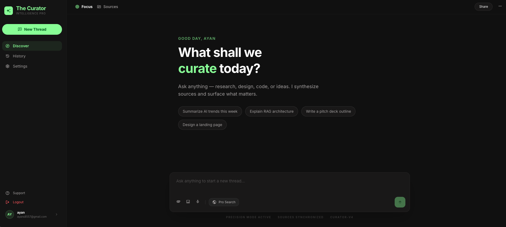

# Perplexity AI Clone 🚀

A production-ready, full-stack AI-powered search engine inspired by Perplexity AI. This application combines the power of Large Language Models (LLMs) with real-time web search capabilities to provide accurate, cited, and up-to-date answers.

🔗 Live Demo: https://perplexity-ai-chi.vercel.app/


## 🌟 Project Overview

This project is a high-performance "Answer Engine" that bridges the gap between static AI knowledge and the live web. It features a modern, responsive UI and a robust backend architecture designed for scalability and maintainability.

### Key Highlights:
- **Agentic Search**: Intelligent routing between internal LLM knowledge and real-time web results.
- **Pro Search Mode**: Deep-dive web search integration using Tavily API.
- **Scalable Architecture**: Decoupled frontend and backend with a modular service-oriented design.
- **Secure by Design**: Implementation of JWT-based authentication, rate limiting, and secure headers.

---

## ✨ Features

### 🔐 Authentication & User Management
- **Full Auth Flow**: Secure Signup, Login, and Logout.
- **Email Verification**: Verification flow powered by Resend.
- **JWT Auth**: Stateless authentication using JSON Web Tokens and HTTP-only cookies.
- **Profile Management**: Customizable user profiles with avatar and settings.

### 💬 Chat & AI
- **Real-time Streaming**: Instant AI responses (via Socket.io).
- **Chat History**: Persistent storage of conversations with the ability to create, delete, and rename chats.
- **Auto-titling**: AI-generated descriptive titles for new conversations.
- **Dual Model Support**: Leveraging Gemini 1.5 Flash for quick queries and Mistral Large for deep-dive searches.

### 🔍 Search & Tools
- **Web Integration**: Real-time internet access via Tavily API.
- **Pro Search**: Toggle between standard LLM responses and agentic web-research-backed answers.
- **Source Citation**: AI responses cite specific web sources for transparency.

---

## 🛠 Tech Stack

| Component | Technology |
| :--- | :--- |
| **Frontend** | React.js 19, Vite, Tailwind CSS 4, Redux Toolkit, Axios |
| **Backend** | Node.js, Express.js, Socket.io |
| **Database** | MongoDB (Mongoose ODM) |
| **AI Orchestration** | LangChain, LangGraph |
| **AI Models** | Google Gemini 1.5 Flash, Mistral AI |
| **Search Engine** | Tavily API |
| **Communications** | Resend (Email), Socket.io (Real-time) |

---

## 🏗 Architecture Explanation

The project follows a **Scalable Multi-Layer Architecture** to ensure clean separation of concerns:

1.  **Routes Layer**: Defines API endpoints and maps them to specific controllers.
2.  **Controllers Layer**: Handles incoming requests, validates input, and orchestrates calls to services.
3.  **Services Layer**: Contains the "Brain" of the application. All business logic, AI orchestration, and third-party integrations (Tavily, Gemini) live here.
4.  **Models Layer**: Defines the data structure and schema for MongoDB.

### Why this architecture?
- **Maintainability**: Changes in business logic (e.g., swapping AI models) only affect the Service layer.
- **Scalability**: Layers can be scaled or refactored independently.
- **Testability**: Decoupled logic makes unit testing services straightforward.
- **Clean Code**: Reduces "Fat Controllers" and keeps the codebase organized.

---

## 📂 Folder Structure

```text
perplexity-ai-clone/
├── Backend/
│   ├── src/
│   │   ├── config/         # Database and Environment configs
│   │   ├── controllers/    # Request handlers
│   │   ├── middlewares/    # Auth, Validation, Rate-limiting
│   │   ├── models/         # Mongoose Schemas
│   │   ├── routes/         # API Route definitions
│   │   ├── services/       # Business logic (AI, Search, Mail)
│   │   ├── sockets/        # Real-time communication logic
│   │   └── validator/      # Request validation schemas (Zod/Express-Validator)
│   ├── server.js           # Entry point
│   └── .env                # Secrets
└── Frontend/
    ├── src/
    │   ├── app/            # Redux Store and Global providers
    │   ├── features/       # Feature-based components (Auth, Chat, Profile)
    │   ├── main.jsx        # App mounting
    │   └── assets/         # Static files
    ├── tailwind.config.js
    └── vite.config.js
```

---

## 🔄 Core Workflows

### 1. Authentication Flow
1. **Submit**: User submits login credentials.
2. **Validate**: Backend validates against MongoDB.
3. **Token**: A signed JWT is generated.
4. **Secure Cookie**: The token is sent to the client via an HTTP-Only cookie.
5. **Session**: Frontend Redux state is updated with user info.

### 2. AI + Web Search Workflow (Pro Search)
1. **User Input**: User submits a query with "Pro Search" enabled.
2. **Analysis**: Backend identifies the intent and generates a search query.
3. **Web Search**: The `internet.service` fetches relevant snippets from **Tavily**.
4. **Context Synthesis**: **LangChain** combines user history + web results.
5. **Final Response**: **Mistral AI** generates a comprehensive answer with citations.

---

## ⚙️ Environment Variables

### Backend (`/Backend/.env`)
```env
PORT=5000
MONGODB_URI=your_mongodb_uri
JWT_SECRET=your_jwt_secret
GEMINI_API_KEY=your_google_ai_key
MISTRAL_API_KEY=your_mistral_key
TAVILY_API_KEY=your_tavily_key
RESEND_API_KEY=your_resend_key
FRONTEND_URL=http://localhost:5173
```

### Frontend (`/Frontend/.env`)
```env
VITE_API_BASE_URL=http://localhost:5000/api
```

---

## 🚀 Installation Steps

1. **Clone the repository**
   ```bash
   git clone https://github.com/your-username/perplexity-clone.git
   cd perplexity-clone
   ```

2. **Setup Backend**
   ```bash
   cd Backend
   npm install
   # Create .env and add variables
   npm run dev
   ```

3. **Setup Frontend**
   ```bash
   cd ../Frontend
   npm install
   # Create .env and add variables
   npm run dev
   ```

---


## 📸 Screenshots




---

## ☁️ Deployment

### Frontend (Vercel)
The frontend is configured for easy deployment on Vercel. 
1. Connect your GitHub repository to Vercel.
2. Set the `VITE_API_BASE_URL` environment variable.
3. Deploy!

### Backend (Render / Railway / DigitalOcean)
1. Set up a Node.js environment.
2. Configure all environment variables listed in the `.env` section.
3. Ensure the MongoDB cluster allows access from your deployment IP.

---

---

## 🔮 Future Improvements
- [ ] **Multi-Modal Search**: Integration of image and video search results.
- [ ] **Advanced Agents**: Multi-agent workflows using LangGraph for complex reasoning.
- [ ] **Export Options**: Exporting research reports in PDF or Markdown format.
- [ ] **Social Sharing**: Ability to share public chat links with the community.

---

## 🎯 Learning Outcomes
- Implementing **Agentic AI** behaviors using LangChain.
- Managing complex state with **Redux Toolkit**.
- Building a high-performance **real-time UI** with Socket.io.
- Designing a **security-first** backend with JWT and Rate Limiting.

## 🚀 Why This Project Stands Out
Unlike basic wrapper apps, this project implements a **true search-augmented generation (RAG)** pipeline. It handles the complexities of real-time web scraping, AI context management, and production-grade authentication, demonstrating a deep understanding of modern full-stack engineering.

---

**Developed with ❤️ by [Ayan Sahil]**
